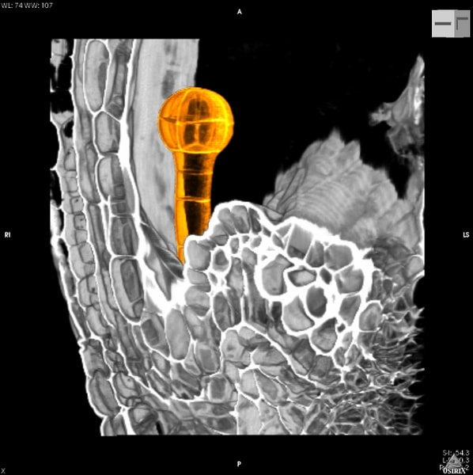

Welcome to an interactive Jupyter Book for the PLOS Computational Biology paper et al. entitled "[*Efficient neural decoding of self-location with a deep recurrent network*](https://journals.plos.org/ploscompbiol/article?id=10.1371/journal.pcbi.1006822)".
It reports that the application of RNNs to neural data allowed flexible integration of temporal context, yielding improved accuracy relative to the more commonly used Bayesian approaches and opens new avenues for exploration of the neural code.

This Jupyter Book lets you interact with a [demo of their code](https://github.com/NeuroCSUT/RatGPS) to reproduce their article plots. You can change the code by inline on the pages or launch a MyBinder session to run your code in a Jupyter Notebook in another tab. The figures are made interactive using [Plotly](https://plotly.com). 

All of the code is contained inside one Jupyter notebook that uses [SoS](https://vatlab.github.io/sos-docs/running.html#content) (Script of Scripts) workflow to enable communication between Python2 and Python3 kernels.